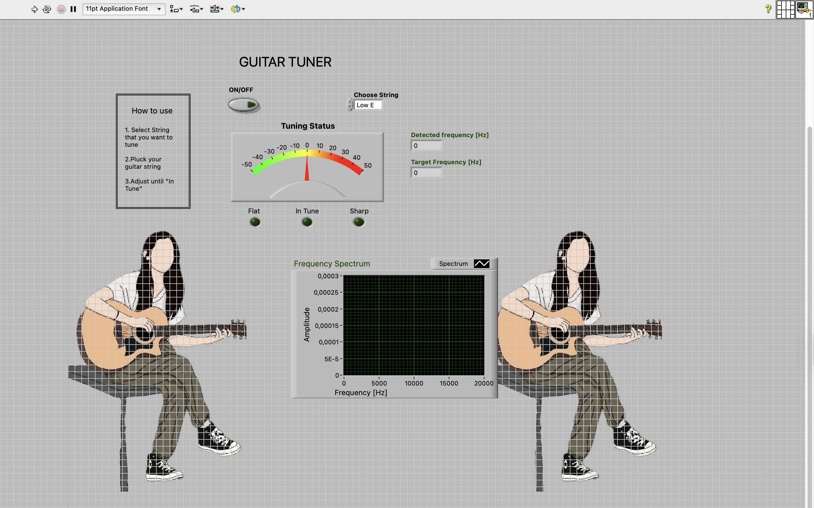
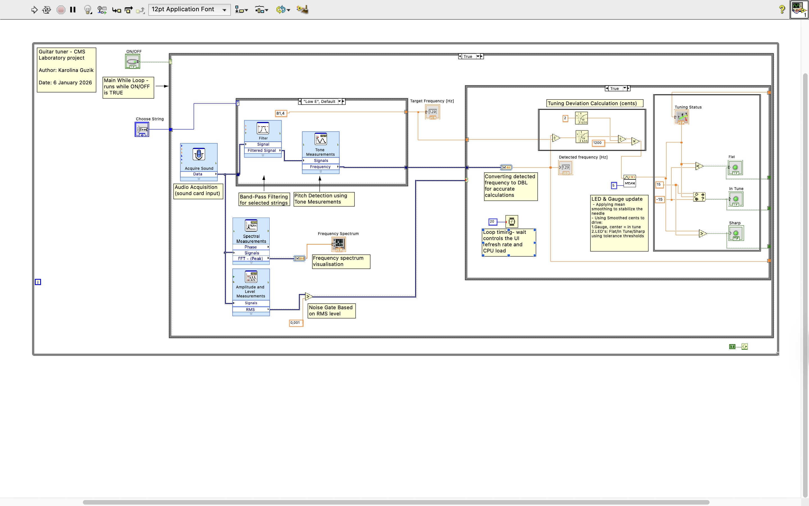

# Guitar Tuner (LabVIEW)

Real-time guitar tuner built in LabVIEW using audio input, pitch detection, and cents-based tuning feedback.

## Features
- Real-time microphone input
- Pitch detection using Tone Measurements
- Cents-based tuning deviation
- Flat / In Tune / Sharp indicators
- Frequency spectrum visualization
- RMS threshold (noise filtering)
- Smooth tuning display (mean filtering)

## How it works
1. Audio is acquired from the sound card
2. RMS threshold filters out background noise
3. Pitch is detected using frequency analysis
4. The detected frequency is compared with the target string
5. Deviation is calculated in cents
6. UI displays tuning status

### Front Panel

### Block Diagram

##  How to run
1. Open `src/Guitar_Tuner.vi` in LabVIEW
2. Select the string
3. Turn ON
4. Pluck a string
5. Tune until “In Tune” is active

## Requirements
- LabVIEW
- Microphone / audio input device

## Author
Karolina Guzik
